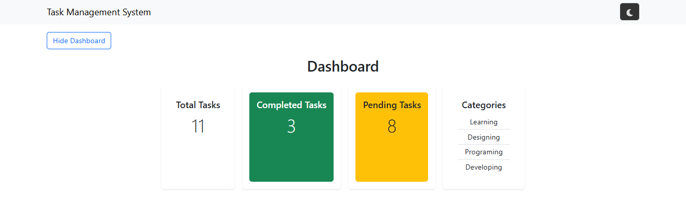
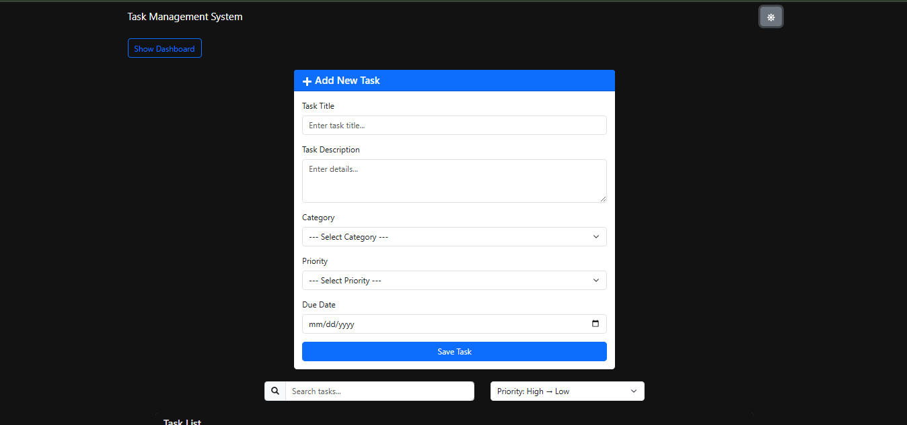
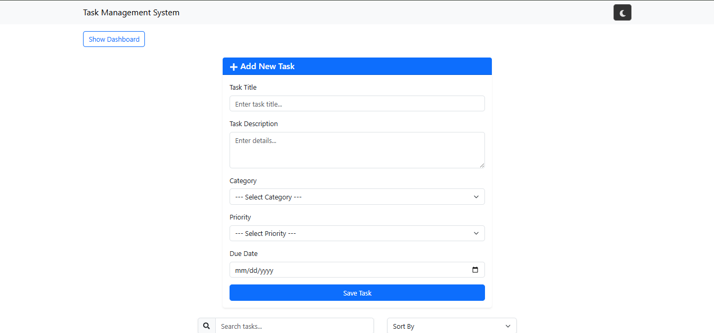
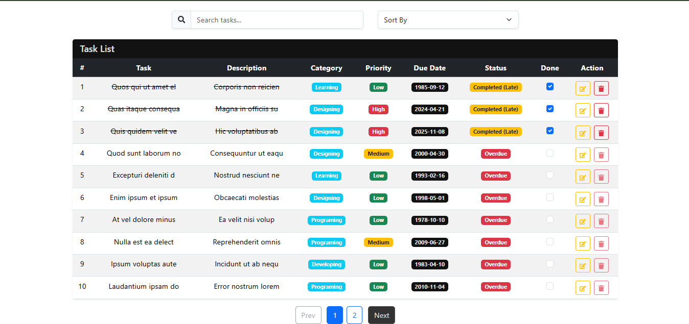

# Task Management System 📋

A modern, responsive task management application built with **React.js** and **Bootstrap**. This system helps users efficiently organize, track, and manage their tasks with an intuitive user interface.

---

## Deployment Options 🌐

Link Here:- 

## Features ✨

- ✅ **Create, Read, Update, Delete (CRUD)** - Full task management capabilities
- 📊 **Dashboard Statistics** - View total, completed, and pending tasks at a glance
- 🌙 **Dark Mode** - Toggle between light and dark themes for comfortable viewing
- 📑 **Pagination** - Navigate through tasks with easy pagination controls
- 💾 **Local Storage** - Tasks are automatically saved to browser's local storage
- 🏷️ **Task Categories** - Organize tasks by categories
- 📱 **Responsive Design** - Works seamlessly on desktop and mobile devices
- 🎨 **Modern UI** - Built with Bootstrap 5 for a clean and professional appearance

---

## Screenshots 📸

### Dashboard View


### Dark Mode


### Task Form


### Task Table


---

## Tech Stack 🛠️

- **Frontend Framework**: React 19.2.0
- **Styling**: Bootstrap 5.3.8
- **Icons**: React Icons 5.5.0
- **Build Tool**: Vite 7.2.4
- **State Management**: React Hooks (useState, useEffect)
- **Storage**: Browser LocalStorage API

---

## Installation 🚀

### Prerequisites
- Node.js (v16 or higher)
- npm or yarn

### Setup Instructions

1. **Clone the repository**
   ```bash
   git clone https://github.com/Soaib-Shaikh/pr-task-management-system-react.js.git
   cd pr-task-management-system-react.js
   ```

2. **Install dependencies**
   ```bash
   npm install
   ```

3. **Run the development server**
   ```bash
   npm run dev
   ```

4. **Open your browser**
   - Navigate to `http://localhost:5173` (default Vite port)

---

## Available Scripts 📜

- `npm run dev` - Start the development server
- `npm run build` - Build the project for production
- `npm run lint` - Run ESLint to check code quality
- `npm run preview` - Preview the production build locally

---


## Project Structure 📁

```
pr-task-management-system-react.js/
├── src/
│   ├── App.jsx                 # Main app component
│   ├── main.jsx                # React entry point
│   ├── assets/                 # Static assets
│   ├── Components/
│   │   ├── Dashboard.jsx       # Dashboard statistics
│   │   ├── Dashboard.css       # Dashboard styling
│   │   ├── Navbar.jsx          # Navigation bar
│   │   ├── TaskForm.jsx        # Add/Edit task form
│   │   ├── TaskList.jsx        # Display tasks
│   │   ├── Pagination.jsx      # Pagination controls
│   │   ├── DarkMode.css        # Dark mode styles
│   │   └── DarkMode.css        # Dark mode themes
│   └── utils/
│       └── localStorage.js     # Local storage utilities
├── output/                     # Screenshots
├── public/                     # Public assets
├── package.json               # Project dependencies
├── vite.config.js            # Vite configuration
├── eslint.config.js          # ESLint configuration
└── index.html                # HTML entry point
```

---

## How to Use 🎯

1. **Add a Task**
   - Click the "Add Task" button
   - Fill in task details (title, description, category, priority, due date)
   - Click "Add" to save

2. **View Tasks**
   - All tasks appear in a table with pagination
   - See task counts in the Dashboard

3. **Edit a Task**
   - Click the "Edit" button on any task
   - Modify the details
   - Click "Update" to save changes

4. **Delete a Task**
   - Click the "Delete" button to remove a task

5. **Mark as Complete**
   - Check the completion checkbox for any task

6. **Toggle Dark Mode**
   - Click the dark mode toggle in the navbar

---

## LocalStorage Features 💾

- All tasks are automatically saved to browser's local storage
- Tasks persist even after closing the browser
- Current pagination page is saved for convenience
- Dark mode preference is remembered

---

## Responsive Design 📱

- Desktop: Full-featured interface
- Tablet: Optimized layout with responsive grid
- Mobile: Touch-friendly interface with stacked layouts

---

## Future Enhancements 🔮

- [ ] Task search and filter functionality
- [ ] Task priority levels and sorting
- [ ] Recurring tasks
- [ ] Task reminders/notifications
- [ ] Export tasks to CSV/PDF
- [ ] Multi-user support with authentication
- [ ] Backend database integration
- [ ] Task calendar view
- [ ] Drag and drop reordering

---

## Contributing 🤝

Contributions are welcome! Please follow these steps:

1. Fork the repository
2. Create a feature branch (`git checkout -b feature/YourFeature`)
3. Commit your changes (`git commit -m 'Add YourFeature'`)
4. Push to the branch (`git push origin feature/YourFeature`)
5. Open a Pull Request

---

## License 📄

This project is open source and available under the [MIT License](LICENSE).

---

## Author 👤

**Soaib Shaikh**
- GitHub: [@Soaib-Shaikh](https://github.com/Soaib-Shaikh)

---

## Support 💬

If you encounter any issues or have suggestions, please:
- Open an issue on GitHub
- Contact the author directly

---

## Acknowledgments 🙏

- React documentation and community
- Bootstrap for UI components
- Vite for fast build tooling
- All contributors and users

---

**Happy Task Managing! 🚀**
